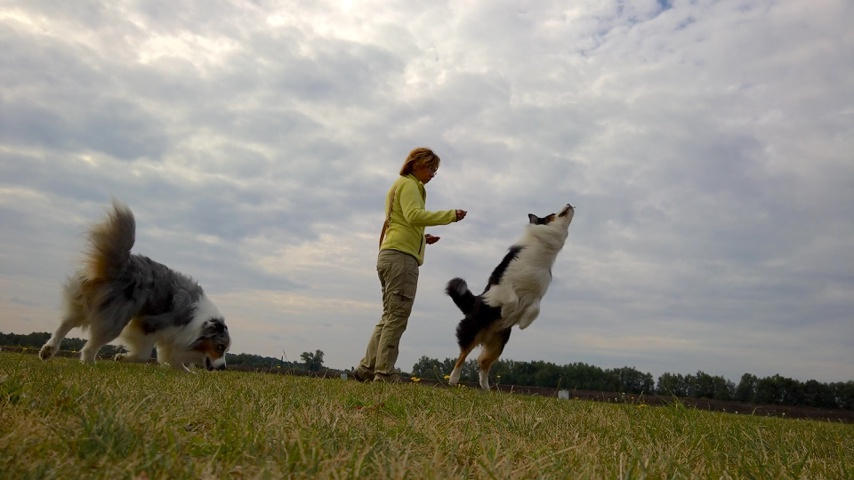
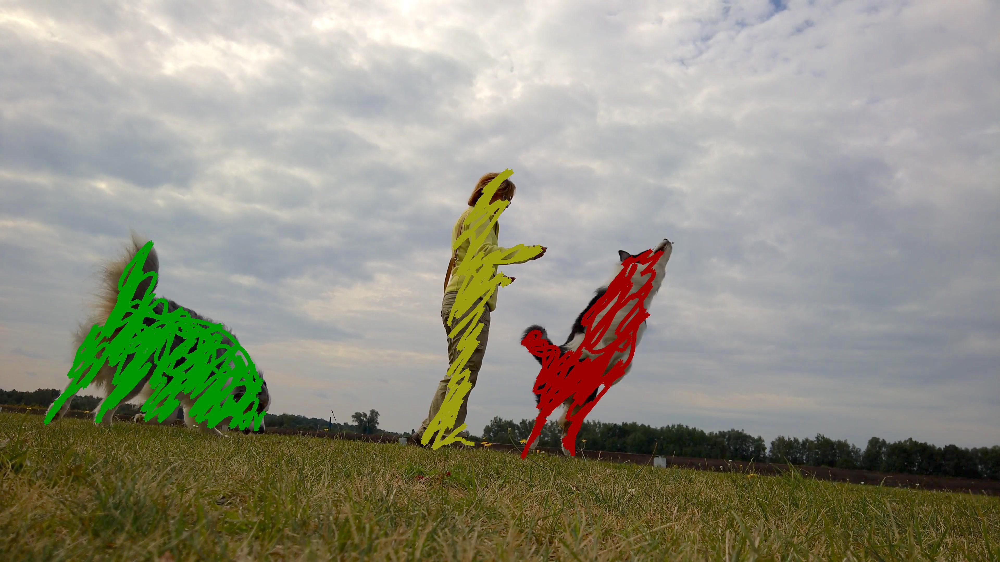
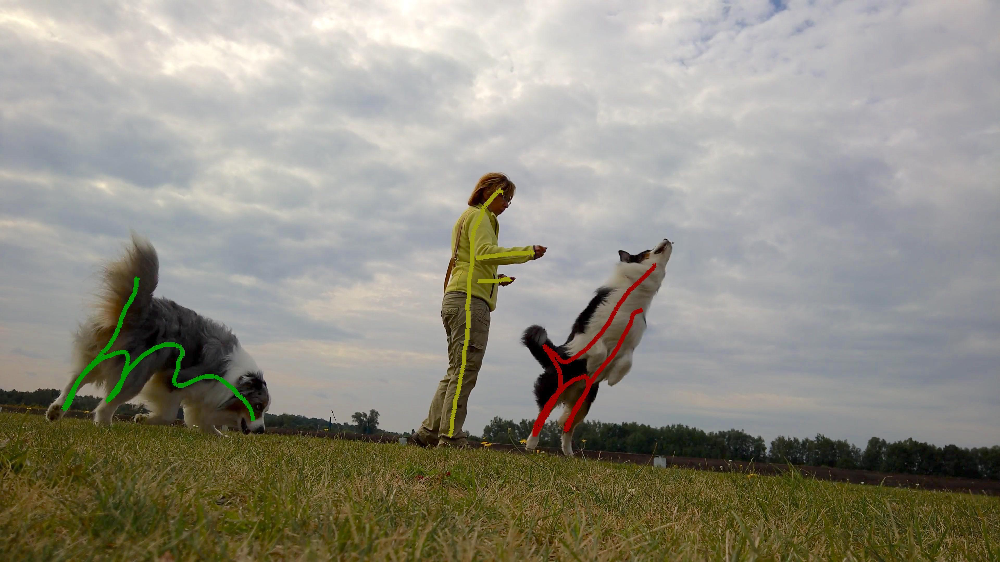

# DAVIS Interactive Evaluation Framework


[](https://travis-ci.org/albertomontesg/davis-interactive) [](https://codecov.io/gh/albertomontesg/davis-interactive) [](https://pypi.org/project/davisinteractive/) [](https://github.com/albertomontesg/davis-interactive/blob/master/LICENSE)

This is a framework to evaluate interactive segmentation models over the <a href="https://davischallenge.org/" target="_blank">DAVIS 2017</a> dataset. The code aims to provide an easy-to-use interface to test and validate interactive segmentation models.

This tool is also used to evaluate the [Interactive Track](challenge.md) of the DAVIS Challenges on Video Object Segmentation. More information about the latest challenge edition in the <a href="https://davischallenge.org/" target="_blank">DAVIS website</a>.

You can find an example of how to use the package in the following repository:

*  <a href="https://github.com/kmaninis/Scribble-OSVOS" target="_blank">Scribble-OSVOS</a>


## DAVIS Scribbles

In the classical DAVIS Semi-supervised Challenge track, the task is to segment an object in a *semi-supervised* manner, i.e. the given input is the ground truth mask of the first frame. In the **DAVIS Interactive Challenge**, in contrast, the user input is scribbles, which can be drawn much faster by humans and thus are a more realistic type of input. 

<div style="white-space: nowrap;">



</div>

The interactive annotation and segmentation consist in an iterative loop which is evaluated as follows:

* In the first interaction, a human-annotated scribble for each object in the video sequence is provided to the segmentation model. As a result, the model has to predict a segmentation mask containing all the objects for all the frames. <br> **Note**: all the scribbles are annotated in a single frame, but this does not have to be the first frame in the sequence, as the annotators were instructed to annotate the most relevant and meaningful frame. This is in contrast to the semi-supervised track, where - only and strictly - the first frame is annotated.
* Then, the predicted masks are submitted to a server that returns human-simulated scribbles. These scribbles are always annotated in a single frame. The frame is selected as the one with the worst evaluation result among a list of frames specified by the user. By default, this list contains all the frames in the sequence.
* During the following steps, the segmentation model keeps iterating between predicting the masks using the new scribbles and submitting the masks to obatain new scribbles.

**Evaluation**: The evaluation metric is the mean of the Region similarity $\mathcal{J}$ and the Contour Accuracy $\mathcal{F}$. More information of the metrics <a href="https://www.cv-foundation.org/openaccess/content_cvpr_2016/papers/Perazzi_A_Benchmark_Dataset_CVPR_2016_paper.pdf" target="_blank">here</a>. The evaluation for the `train` and `val` subsets can be done offline at any time, whereas the evaluation for the `test-dev` has to be done against a server that is only available during the challanges period.

**More information**: Please check the [Installation](user_guide/installation.md) guide to install the package and dowload the scribbles. Moreover, refer to the [Usage](user_guide/usage.md) guide to learn how to interface your code with the server.

**Contributions**: If you would like to add new features to the package, please do not hesitate to send a [pull request](https://github.com/albertomontesg/davis-interactive/pulls).

## Citation

Please cite both papers in your publications if DAVIS or this code helps your research.

```tex
@article{Caelles_arXiv_2018,
  author = {Sergi Caelles and Alberto Montes and Kevis-Kokitsi Maninis and Yuhua Chen and Luc {Van Gool} and Federico Perazzi and Jordi Pont-Tuset},
  title = {The 2018 DAVIS Challenge on Video Object Segmentation},
  journal = {arXiv:1803.00557},
  year = {2018}
}
```

```latex
@article{Pont-Tuset_arXiv_2017,
  author = {Jordi Pont-Tuset and Federico Perazzi and Sergi Caelles and Pablo Arbel\'aez and Alexander Sorkine-Hornung and Luc {Van Gool}},
  title = {The 2017 DAVIS Challenge on Video Object Segmentation},
  journal = {arXiv:1704.00675},
  year = {2017}
}
```

